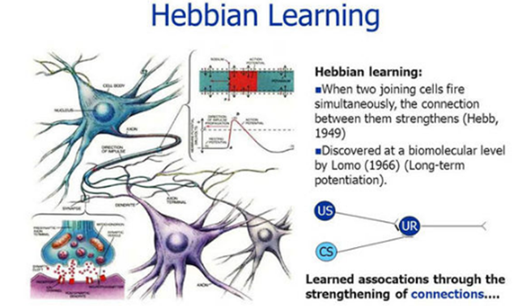

# Stock-Analysis-by-Hebbian-Learning

Analyzing relationship between two data using Hebbian Learning concept found in Neuro Science

## Description

This simple python project is an approach of analyzing relationship between two data by mathematically utilizing Hebbian Learning

## Getting Started

### Dependencies

* Using Python 3

### Installing

* Get the files or clone the repo

### Executing program

* Run the main.py after tinkering the code for your own needs after understanding the mechanism

* Results
   * The list below is the top 30 relationships from the highest to lowest.
NIO	361	0.055032	0.000152  
GLUU	2427	0.344327	0.000142  
ROKU	601	0.078771	0.000131  
CSIQ	2427	0.310159	0.000128  
SLDB	519	0.063017	0.000121  
SPWR	2427	0.293803	0.000121  
TWTR	1580	0.190712	0.000121  
PGEN	1644	0.198251	0.000121  
PS	442	0.053301	0.000121  
SMAR	456	0.054935	0.00012  
ESTC	344	0.041331	0.00012  
PTCT	1678	0.201135	0.00012  
NIU	334	0.039672	0.000119  
APLS	571	0.067614	0.000118  
SQ	1068	0.125367	0.000117  
JKS	2427	0.283434	0.000117  
FEYE	1614	0.188422	0.000117  
ZIOP	2427	0.281169	0.000116  
HALO	2427	0.280203	0.000115  
DDD	2427	0.277854	0.000114  
CDLX	509	0.058262	0.000114  
YELP	2004	0.229266	0.000114  
RUBY	400	0.045538	0.000114  
PRNB	359	0.040656	0.000113  
EDIT	1018	0.115195	0.000113  
ARLO	388	0.043803	0.000113  
SSYS	2427	0.273731	0.000113  
SRPT	2427	0.273223	0.000113  
LTHM	340	0.038146	0.000112  
  
* NIO had a high relationship of 0.000152, and the reason is because NIO is also an electric car company. 
* GLUU and ROKU are entertainment companies, and most of the high ranked companies in the list are solar power related or 3D printing or pharmacy & biotech companies.
* This shows that not also it shows the related industry like solar power and 3D printing, it also shows which industry has a similar pattern, like eco energy, entertainment, and bio moves together. This is because some trends move together.

## Help

This program can be improved via using numpy and other libraries

## Authors

SunWu Choi

## Version History

* 0.1
    * Initial Release

## License

No License

## Acknowledgments

